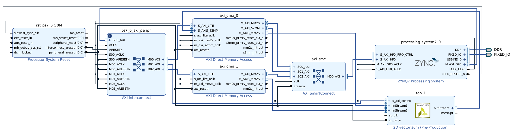

### 2D Vector Sum test

This kernel sums two vectors with weights and bias and returns the sum vector; it takes in input:

* 2 integer vectors `V1` and `V2` of equal length
* the number of elements inside a vector (a scalar)
* three scalars `a`, `b` and `c`

and returns the vector sum `V3 = a * V1 + b + V2 + c`.

It is implemented in C to be synthesized with Vivado HLS. To take in input the scalar values, the HLS kernel has an AXI control interface bundle called `control` where the control interface (ap_start/done/idle) are mapped together into registers with the scalar inputs, at different offsets of the AXI interface. To check the offsets, the quickest way is run the HLS synthesis, package the IP and inspect the file `vec_2d_sum/hls/pynq_vec_2d_sum/solutions_1/impl/verilog/top_vec_2d_sum_control_s_axi.v`, looking for the `Address Info` fields. These registers are memory-mapped into the physical memory of the PYNQ, accessible from ARM, so that the software can pass the input by writing the appropriate memory locations and control the running status.

This design also features two DMAs to send data to the two input streams (one per input vector) simoultaneously. DMA 0 is also used to send the result vector back.
Note that the host code provided in this test assumes the scalar input offsets are configured as in the file above.

The block diagram is

